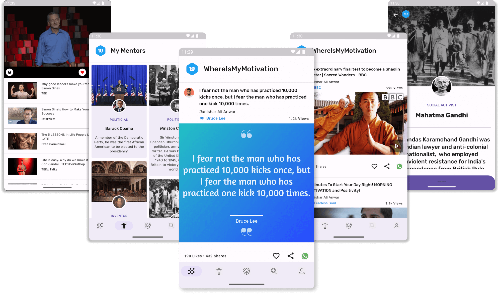
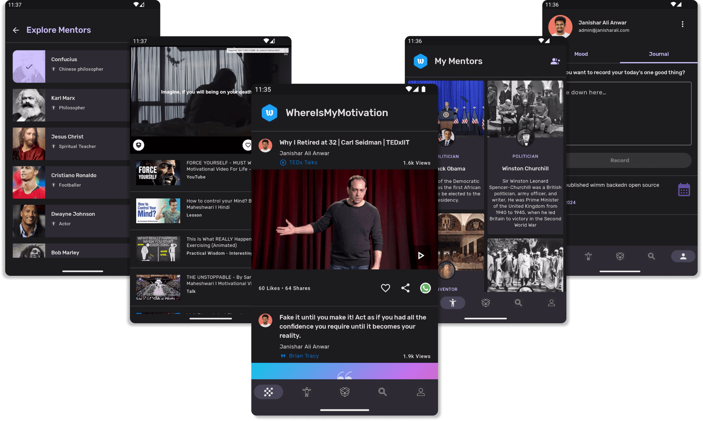

# App Screenshots

## Framework

- MVVM
- Material Design 3
- Navigation
- ViewModel
- Compose
- Co-Routines
- Flow
- Hilt
- Retrofit
- OkHttp
- Coil
- Room
- DataStore
- Firebase
- Work Manager
- Crashlytics
- Analytics
- Notifications

## Highlights

- Single Activity
- Dark and light theme
- Modular Retrofit architecture
- SharedFlow for communication
- Reusable UI components
- Notification framework
- Sharing feature
- 100% Kotlin
